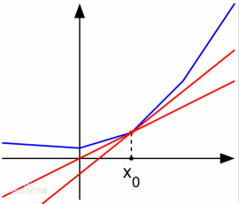

# Logistic 回归的 Loss 函数为什么长成那个样子？

一般人大概都能想得到，Logistic 回归的 Loss 函数应该是下面的样子。
（以下是正常的版本。）
$$
\begin{aligned}
Loss(h_{\theta}, \, y) &=\frac{1}{n} \sum_{i=1}^{n} \frac{1}{2}[h_{\theta}(x_{i})-y_{i}]^{2} \\
& =\frac{1}{2}\left(\frac{1}{1+e^{-\theta^{\mathsf{T}}x}}-y\right)^{2}
\end{aligned}
$$
这里 $1/2$ 是为了求导后方便计算的系数，不重要。
$n$ 是样本数量。
括号里面就是分错的部分了，很容易理解。

但实际上，它的 Loss 函数长成了这个样子：
$$
Loss = 
\left \{ \begin{aligned}
& -\log (h_{\theta}(x)) & \qquad \text{if }y=1 \\
& -\log (1-h_{\theta}(x)) & \qquad \text{if }y=0
\end{aligned} \right.
$$
为什么呢？

答案是：**保证凸性**。
第一个 Loss 函数不是凸函数，而取过了 $-\log$ 并且分段以后就变成凸函数了。

# 凸优化 及 梯度下降法

几乎每一个机器学习问题都是一个优化问题。
而在所有优化问题当中，有一类优化问题是人们非常关心的，并希望每一个优化问题都能转化为这样的优化问题的，那就是凸优化问题（convex optimization）。

一类常见的凸优化问题就是目标函数是凸函数，并且边界条件是仿射集的优化问题。如：支持向量机（SVM） 、 感知机（Perceptron）等等。
为什么要研究凸优化呢？因为凸函数有一个优点——全局最小值。
它可以让人们明确一个信念，即：所研究的问题一定是可学习的，而且一定在全局有一个固定结果，并不会踩到某个局部极值从而达不到最优。

那么如何求得这个最值呢，一般的方法是利用梯度下降法（gradient descent，GD）。
由于凸函数有一个一阶条件：$f(y) \ge f(x) + \nabla f(x)^{\mathsf{T}}(y-x)$ ，所以我们很容易看到，沿着目标函数 $f$ 的梯度方向一直下降的话（其实是梯度方向的反向，因为要下降），终究会像从沙滩上滑下一般到达最小值。
（顺便一说凸函数还有一个二阶条件：$\nabla^{2}f(x) \ge 0$ 。）

那么，问题来了，如果目标函数不是光滑的怎么办？
比如 $y=|x|$ ，这很明显是一个凸锥。
再比如，神经网络（neural net，NN）中最常见的激活函数（activation Function）：ReLU，这也是一个凸锥。

解决方法是提出次梯度（subgradient）的概念。
所谓次梯度，是一个很像梯度的，但是是个常量的 $g$ ，它满足：$f(y) \ge f(x) + g^{\mathsf{T}}(y-x)$ 。
形式上是不是和凸函数的一阶条件很像？因此我们实际上是找了一个很像梯度的替代品。
例如：在 $y=|x|$ 的条件下，我们可以把原点的次梯度定义为 0。在ReLU的条件下，我们把原点的次梯度定义为 $1/2$ 等等。
样子如下图中的红线的斜率：

（原图来自 [百度百科：次导数](https://baike.baidu.com/item/次导数/13882223?fr=aladdin)）

# 扩展：Softmax 模型的 Loss 函数—— Log-Sum-Exp 函数

这里就不给出函数的形式了，大家请自行 wiki。
总之来说，是 Logistic 模型的 Loss 函数的高阶扩展。也是一个带有一堆 $\log$ 、$\exp$ 还要求加和的式子。

它的凸性可以证明如下：

首先，我们考虑函数 $f(x) = \log (\sum \alpha_{i} e^{x_{i}})$ ，我们证明它是凸的。然后根据凸函数的性质 Affine composition 来导出 Log-Sum-Exp 函数是凸的。
（Affine composition 指的是：$f(x)$ 是凸的 $\Leftrightarrow f(Ax+b)$ 也是凸的，即对自变量做仿射变换不影响凸性。）

考虑：
$$
\begin{aligned}
\nabla_{i} f & = e^{x_{i}}\Big/\sum_{k} e^{x_{k}}  & \\
\nabla_{i}^{2} f & = \mathrm{diag}(z)-zz^{\mathsf{T}}, \, z_{i} = e^{x_{i}}\Big/\sum_{k} e^{x_{k}}
\end{aligned}
$$
显而易见，$\nabla_{i}^{2} f$ 是对角优势矩阵（diagonally dominant matrix）。
（对角优势矩阵：对矩阵 $A$ 的所有对角元，有 $A_{ii} \ge \sum_{i \ne j} |A_{ij}|$ 。）
因此，$\nabla_{i}^{2} f$ 是半正定的（positive semidefinite matrix，p.s.d）。
所以得到 Log-Sum-Exp 函数是凸的。